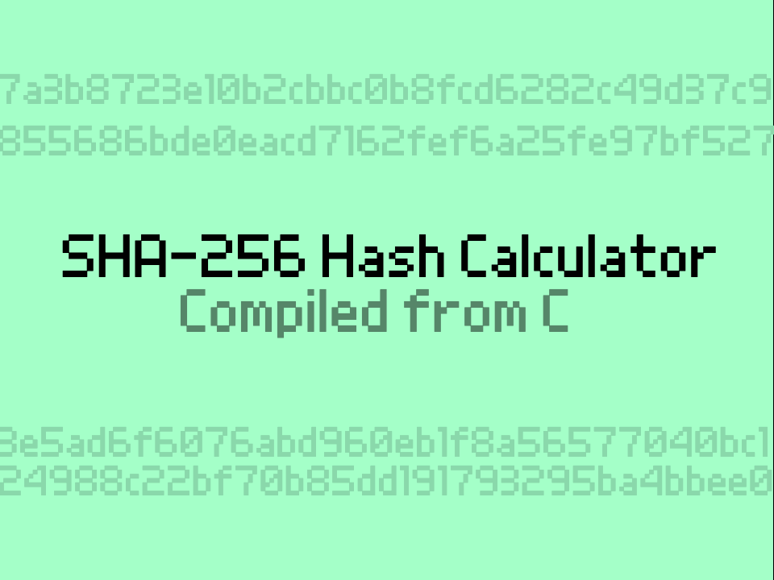

# SHA256.c

## SHA256 port to scratch

https://scratch.mit.edu/projects/1308874118/

For text version of code (less laggy), see [releases tab](https://github.com/Classfied3D/sha2scratch/releases)

## Instructions
Enter a string to calculate its SHA-256 hash. Only ASCII is supported the max input string length is 300 (I set this limit in C, but it can be increased further by modifying the code).

Enter "perf" to calculate 100 hashes and measure the time it took to calculate them. 1 microsecond = 0.000001 seconds.

Verify the result is correct here: https://emn178.github.io/online-tools/sha256.html

## Notes and Credits
This program was compiled using llvm2scratch, my C to scratch compiler: https://github.com/Classfied3D/llvm2scratch

See the forum post: https://scratch.mit.edu/discuss/topic/834571/

The original source code can be viewed here: https://github.com/Classfied3D/sha2scratch (as well as a text form of the scratch code in the releases section)

Turbowarp support is limited. Due it it's recursion limit being much lower it doesn't run without sacrificing a lot of performance. It can run a few hashes before stopping and the performance test is broken. This will be fixed in the future.

I did not write this implementation of SHA-256, I just picked an existing one that doesn't rely on *too* many stdlib functions to prove the ability of my compiler. After making some adjustments to use 32-bit values, it compiles!

This is the fastest sha256 implementation I've found on scratch by far (most are ~1Hz) and I haven't even compiled it with llvm optimizations (due to it requiring correct byte offsets which haven't been added yet)! I am planning on improving the optimizer in future as well.
